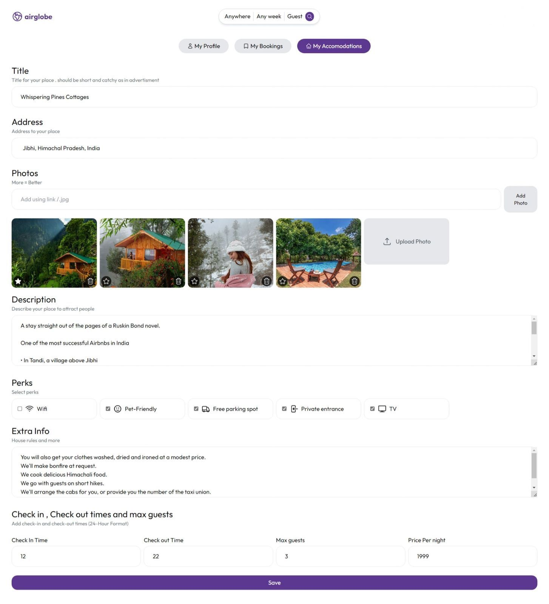
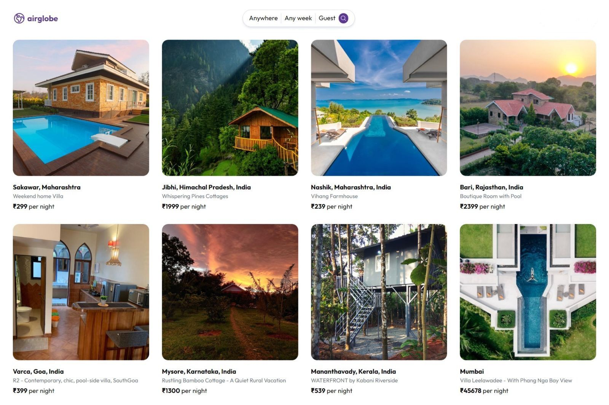

# Airbnb Clone using MERN Stack

This repository contains the source code for an Airbnb clone built using the MERN stack, which consists of MongoDB, Express, React, and Node.js. The project includes a client folder for the React frontend and an api folder for the Node.js backend. The client uses Vite for development and the api uses nodemon for hot reloading.


## Run Locally

Clone the project


```bash
  git clone https://github.com/pratheeshkumar99/airglobe.git 
  cd project-folder
```

For frontend vite + reactjs
```
  cd client
  npm run dev
```

For backend 
```
  cd api
  nodemon index.js
```
## Screenshots





## Authors

- [@pratheeshkumar99](https://www.github.com/pratheeshkumar99)


## Environment Variables

To run this project, you will need to create .env file in api folder and add the following environment variables to your .env file  

`MONGO_URL` you can get this using mongodb atlas

`SECRET_KEY` any random text


## Feedback

If you have any feedback, please reach out to us at lnu.prat@northeastern.com


## Tech Stack

**Client:** React, Vite, TailwindCSS

**Server:** Node, Express, MongoDB